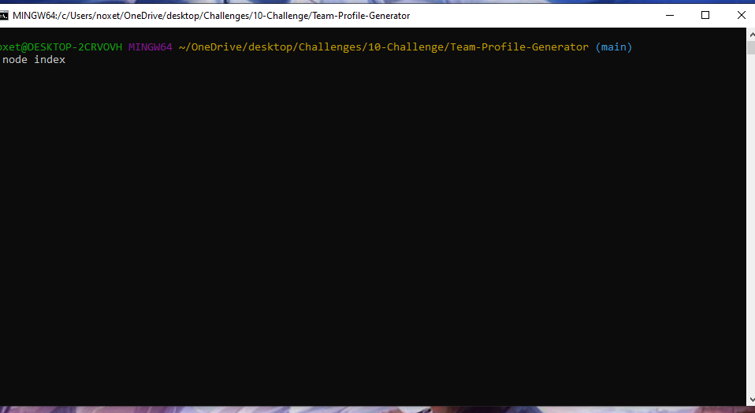
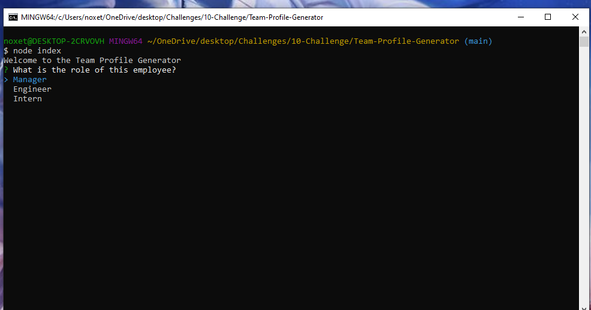
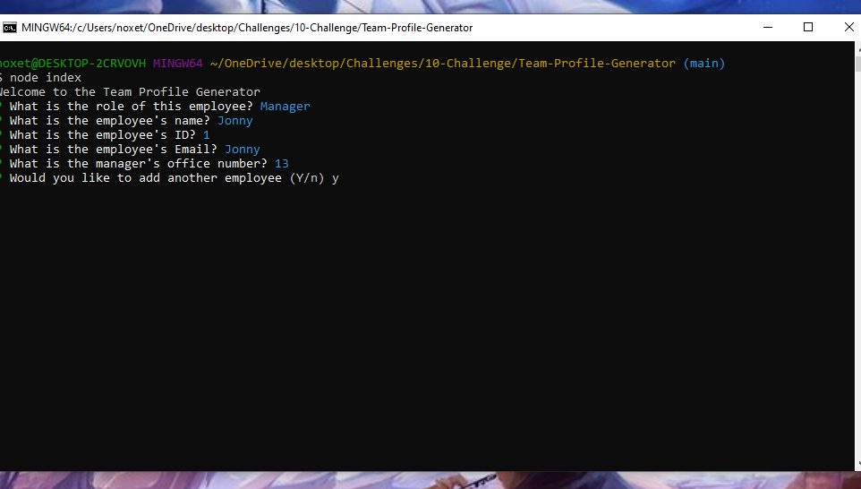
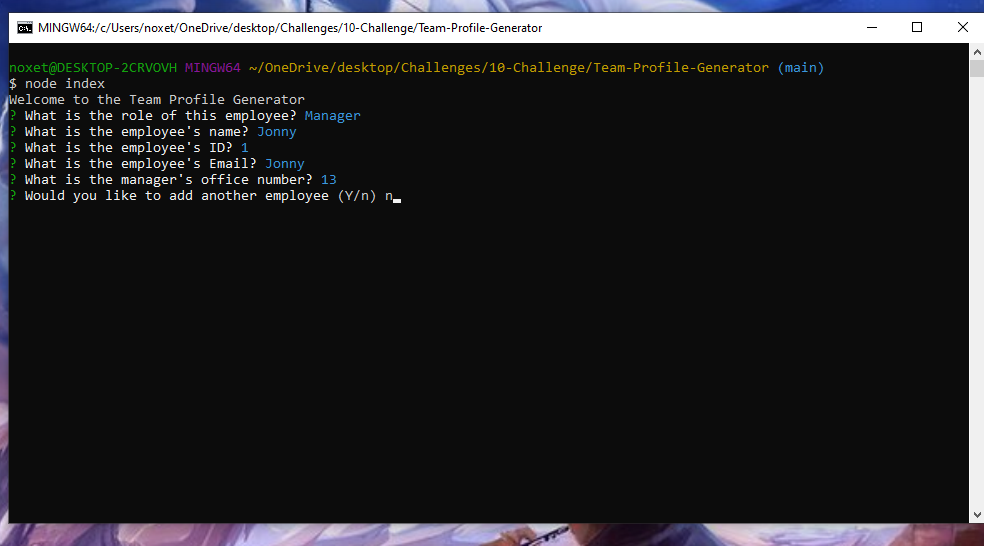

# Team Profile Generator

## Description

A command line app that generates an HTML file that shows members of a team based on user input.

## Usage

* Use command 'node index' to start application

<<<<<<< HEAD

*Choose which kind of employee you would like to add

*Answer questions when prompted

* Press y or just press enter to add another employee

* When you've added all your employees just answer enter n and it will generate the page.

## Contributing

* Jonathan Faulkner
** Javascript
** HTML
** Node.js

## Links
[GitHub]https://github.com/JonnyFaulkner/Team-Profile-Generator)

## Video
[Video](https://drive.google.com/file/d/120C0ICeD8Cb2xUWsA0IGUJwVlOL7mxJP/view)
=======
>>>>>>> 6441ae34b3158fccafcfd72ba896342e49a77014
